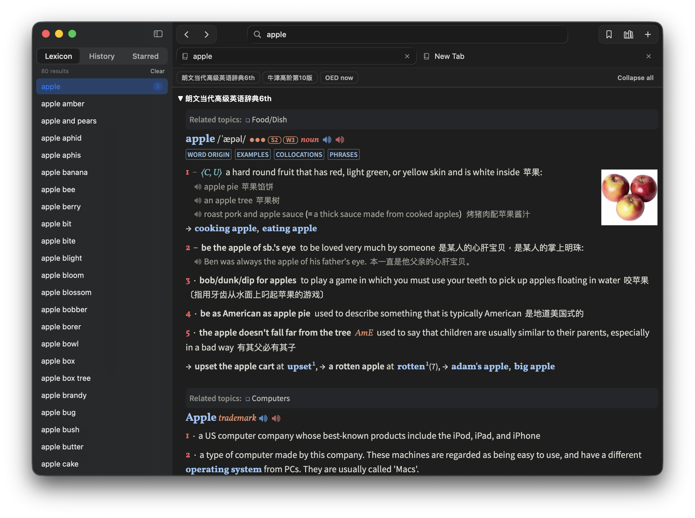

<p align="center">
  
</p>

<h1 align="center">Lexicon</h1>

A native macOS dictionary app that reads **MDX/MDD** dictionary files — the
format used by MDict, GoldenDict, Eudic and friends. Import your own
dictionaries (Oxford, Merriam-Webster, Collins, Longman, …) and search all of
them at once. Imported content works offline; HTTPS resources used by a
dictionary can optionally load under Settings → Dictionary Content.

Lexicon ships no dictionary content. You supply `.mdx` files (with their
`.mdd` resource companions) that you have obtained yourself.

Looking for dictionaries? The MDX/MDD files shared by
[karx on the FreeMdict forum](https://forum.freemdict.com/u/karx/summary)
are a great fit for Lexicon — browse that page and download whichever
dictionaries you want.

<p align="center">
  
</p>

## Install

Lexicon follows the current macOS release and currently requires macOS 26 or later. Download the ZIP for your Mac from the
[GitHub Releases](https://github.com/yichenzhu1/lexicon/releases) page, unzip
it, and move `Lexicon.app` to `/Applications`.

The current build is for Apple Silicon (`arm64`). Release-specific details are
listed in the release notes rather than encoded in the filename.

## Features

- **One search box for every dictionary.** Unified, case- and
  diacritic-insensitive search across all enabled dictionaries, in tiers:
  exact and prefix matches first, then substring matches, then near misses
  when nothing matched literally.
- **Each dictionary keeps its own look.** Entries render with the
  dictionary's own CSS, images, and fonts served straight out of its `.mdd`,
  in one collapsible section per dictionary, with a jump bar when several
  dictionaries have the word.
- **A browser, not a form.** Windows and tabs with per-tab back/forward
  navigation, cross-reference links, look-up-on-double-click, and text zoom —
  all remembered between launches.
- **Live translation.** Compatible OED/ODE/Longman dictionaries translate
  definitions and examples via Apple Translation (on-device), Google Cloud,
  DeepL, or Alibaba DashScope. See *Live translation* below.
- **Sentence text-to-speech.** System voices or Google Cloud Chirp 3 HD
  voices, plus pronunciation audio (`sound://`) played from `.mdd` resources.
  See *Text-to-speech* below.
- **Offline-first and private.** Imported dictionaries work fully offline;
  HTTPS content is optional, and API keys live in macOS Keychain, never
  exposed to dictionary content.
- **A real dictionary manager.** Import (with automatic `.mdd`/CSS/JS
  companions), enable/disable, drag to reorder, rename, and remove — plus
  lookup history and starred words in the sidebar.
- **Broad MDX support.** MDX v1/v2, zlib/LZO/uncompressed blocks, encrypted
  keyword indexes, UTF-8/UTF-16/GB18030/Big5, and multi-part MDDs.

The full list of changes in each version is in [`CHANGELOG.md`](CHANGELOG.md).

MDX v3 files (produced by MdxBuilder 4.x) are not supported; rebuild those
with MdxBuilder 3.x.

## Internal builds

Requires the current macOS SDK and a Swift compiler paired with that SDK.
Command Line Tools work when their compiler and SDK were installed together.

```sh
# Fast, unoptimized developer build
scripts/make_app.sh debug
open build/Lexicon.app

# Optimized internal build
scripts/make_app.sh release
open build/Lexicon.app
```

Local builds are ad-hoc signed and are for development or trusted internal
testing only. Override the default version or build number when needed:

```sh
LEXICON_VERSION=0.2.0 LEXICON_BUILD_NUMBER=2 scripts/make_app.sh release
```

## GitHub release

1. Update `CHANGELOG.md`, then run `swift run MdxKitTester`.
2. Build the release archive:

   ```sh
   LEXICON_VERSION=0.2.0 LEXICON_BUILD_NUMBER=2 scripts/release.sh
   ```

   This writes `dist/Lexicon.zip`. The version is embedded in the app's
   `Info.plist`, not in the archive filename.

3. Commit all release changes.
4. Tag the exact commit, push, and publish the ZIP:

   ```sh
   git tag -a v0.2.0 -m "Lexicon 0.2.0"
   git push origin main
   git push origin v0.2.0
   gh auth login
   gh release create v0.2.0 \
     dist/Lexicon.zip \
     --title "Lexicon 0.2.0" \
     --generate-notes
   ```

## Import dictionaries

Drag a `.mdx` onto the window, or click the books icon in the toolbar (or
⇧⌘I) and choose one. Any sibling files sharing its base name (`Dict.mdd`,
`Dict.1.mdd`, `Dict.png`, …) are copied along with it and indexed. Every `.css`
and `.js` file beside the MDX is also imported even when its name differs (for
example, `oald-fork.mdx` with `oald.css`, `oaldzh.css`, and `oald.js`). Lexicon
then discovers static local references in entry HTML and copied CSS and brings
along those dependent loose assets recursively. Everything lives in
`~/Library/Application Support/Lexicon/`.

If no MDD resources or loose companions are available, the import still
succeeds. Lexicon reports that condition and flags the dictionary in the
manager.

## Theming (custom.css)

Every entry page loads an optional `custom.css` from the dictionary's folder
in `~/Library/Application Support/Lexicon/Dictionaries/<id>/`, after the
dictionary's own stylesheets — drop a file there to restyle a dictionary.

## Text-to-speech

Lexicon can replace the online sentence TTS used by compatible ODE and OALD
repacks. Choose a provider in **Settings → Speech**:

- **System Voice** is the default. It uses English voices installed on the Mac,
  stays on-device, and works with dictionary network access disabled.
- **Google Cloud** uses Chirp 3 HD voices. Enable the Cloud Text-to-Speech API
  and billing in a Google Cloud project, create an API key restricted to that
  API, and paste it into Settings. The key is stored in macOS Keychain and is
  never exposed to dictionary JavaScript.

When a compatible dictionary requests sentence audio, Lexicon sends only the
requested English text and locale to the selected provider. Google Cloud usage
may incur charges.

## Live translation

Compatible OED, ODE, Longman 6, and similar repacks attach translation prompts
to definitions and example sentences. Lexicon intercepts both DashScope
`chat/completions` requests and Longman's signed iFlytek WebSocket before any
bundled credential or passage leaves the page. Choose a provider in
**Settings → Translation**:

- **Apple Translation** is the default. It uses the system Translation
  framework on-device and can ask permission to download the English and
  Simplified Chinese language models on first use. It needs no API key.
- **Google Cloud Translation** extracts only the source passage, accounting
  for both OED/ODE's source-first prompts and Longman's instruction-first
  prompts. It is the predictable choice for modern example sentences. Enable
  the Cloud Translation Basic API and use a key restricted to that API.
- **DeepL** translates the extracted passage through the v2 API. Free keys
  ending in `:fx` automatically use the Free endpoint; Pro keys use the Pro
  endpoint. OED's `<m>`, `<n>`, and `<o>` markup is preserved, with lemma and
  small-cap tags excluded from translation.
- **Alibaba DashScope** sends the dictionary's complete contextual prompt to
  the selected OpenAI-compatible model. This best preserves the OED/ODE
  repacks' definition-aware instructions and markup. Lexicon suggests
  `qwen3.7-plus` (or `qwen3.7-plus-us` in Virginia), but leaves the model name
  editable as regional availability changes.
- **Off** disables network and Apple live translation. Bundled bilingual
  content, including OALD's hidden Chinese examples, still works locally.

Cloud translation keys are stored separately in macOS Keychain and are never
exposed to dictionary JavaScript. At most one translation request is accepted
per real click, passages are capped at 20 KB, and output is currently Simplified
Chinese. Provider calls are made by Lexicon itself, so live translation can
remain under the user's control even when dictionary-page network access is
disabled.

## Tests

```sh
swift run MdxKitTester
swift run Lexicon --tab-state-test
swift run Lexicon --tab-webview-test
```

The Command Line Tools ship neither XCTest nor swift-testing, so tests run
through a small standalone runner. Parser tests validate against fixture
dictionaries generated by the reference
[writemdict](https://github.com/zhansliu/writemdict) library
(`python3 tools/make_fixtures.py` regenerates them).

The suite also covers several things worth knowing about:

- **Damaged files.** Dictionary files are untrusted input, so every size and
  count in a header is validated. The corrupt-file tests feed the parser
  truncated, randomly damaged and deliberately oversized headers and require
  it to throw rather than trap. A regression shows up as the test executable
  crashing mid-run — that is the intended signal.
- **Concurrent access.** The library is read from the main thread and from the
  `dict://` handler's queue while imports run on their own queue, so the
  concurrency tests hammer it from many threads and check that reads stay
  available and correct during an import.
- **Rendering compatibility.** Page tests cover per-dictionary origins,
  structural-tag neutralization, URL/CSS normalization, lazy frames, anchors,
  network policy, and native-bridge isolation.
- **Tab isolation.** The app-state test checks the three-view MRU limit,
  eviction and closure, per-tab history, and delayed WebKit scroll messages.
- **Recovery.** Imports use a staging directory and one index transaction;
  cancellation and startup-reconciliation tests require partial work to be
  removed or moved to the recoverable `Dictionaries/Recovery` directory.

There is also an end-to-end render check that drives a real offscreen
WKWebView, useful after touching the page builder or the scheme handler:

```sh
swift run MdxKitTester seed /tmp/lexicon-smoke
LEXICON_ROOT=/tmp/lexicon-smoke swift run -c release Lexicon --smoke-test
```

## Project layout

- `Sources/MdxKit` — MDX/MDD parser, SQLite keyword index, dictionary library.
  `DictionaryLibrary` is thread-safe; reads run on pooled SQLite connections so
  an import never blocks a search.
- `Sources/Lexicon` — SwiftUI app (search UI, WKWebView renderer, `dict://`
  scheme handler). `LibraryModel` holds the one open library shared by every
  window; `AppState` holds one window's search field, results and tabs.
- `Sources/MdxKitTester` — standalone test runner
- `tools/` — fixture generator plus the vendored writemdict library

## Acknowledgements

- MDX format documentation: [writemdict fileformat.md](https://github.com/zhansliu/writemdict/blob/master/fileformat.md)
  and [mdict-analysis](https://bitbucket.org/xwang/mdict-analysis)
- LZO1X decompression provided by the MIT-licensed
  [lzokay](https://github.com/AxioDL/lzokay) implementation
- Test fixtures generated with [zhansliu/writemdict](https://github.com/zhansliu/writemdict)

## License

Lexicon is licensed under the
[Apache License 2.0](https://www.apache.org/licenses/LICENSE-2.0) — see
`LICENSE` for the full terms. Third-party dependencies and their licenses
are disclosed in [`THIRD-PARTY-NOTICES.md`](THIRD-PARTY-NOTICES.md).
