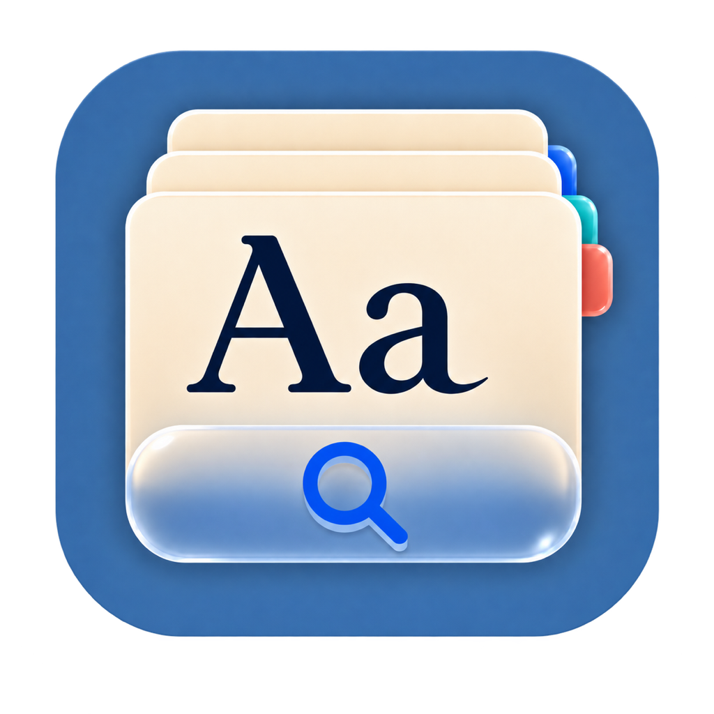
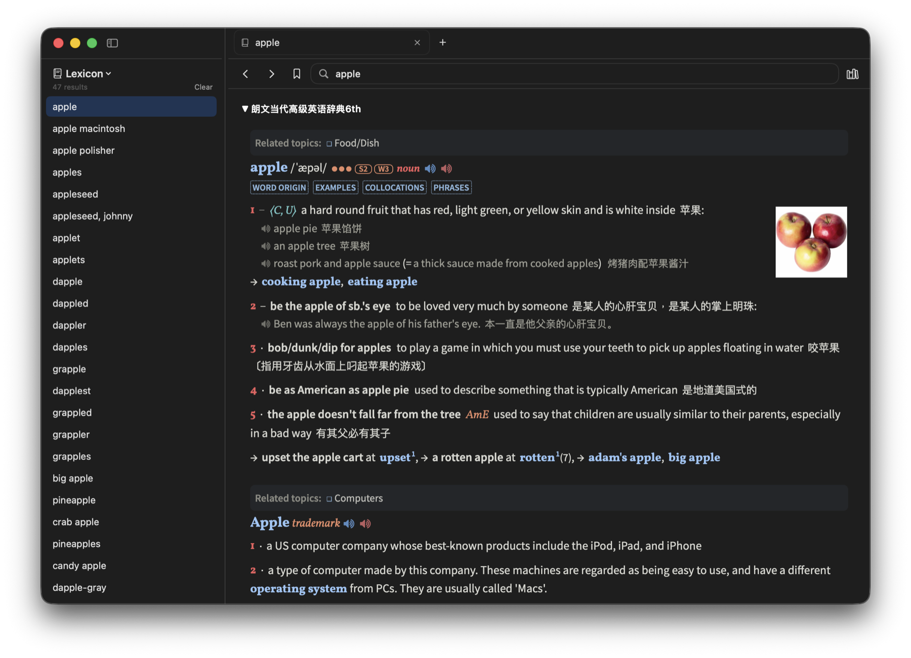

<p align="center">
  
</p>

<h1 align="center">Lexicon</h1>

A native macOS dictionary app that reads **MDX/MDD** dictionary files — the
format used by MDict, GoldenDict, Eudic and friends. Import your own
dictionaries (Oxford, Merriam-Webster, Collins, Longman, …) and search all of
them at once, fully offline.

Lexicon ships no dictionary content. You supply `.mdx` files (with their
`.mdd` resource companions) that you have obtained yourself.

<p align="center">
  
</p>

## Install

Lexicon requires macOS 14 or later. Download the ZIP for your Mac from the
[GitHub Releases](https://github.com/yichenzhu1/lexicon/releases) page, unzip
it, and move `Lexicon.app` to `/Applications`.

The current build is for Apple Silicon (`arm64`). Release-specific details are
listed in the release notes rather than encoded in the filename.

## Features

- Unified search across every enabled dictionary (case- and
  diacritic-insensitive), in tiers: exact and prefix matches first, then
  substring matches, then near misses when nothing matched literally
- One collapsible card per dictionary for each looked-up word, rendered with
  each dictionary's own CSS/images/fonts served straight out of its `.mdd`.
  Collapsed dictionaries stay collapsed, and a jump bar appears when several
  dictionaries have the word
- Text zoom (⌘+ / ⌘− / ⌘0) and look-up-on-double-click, both remembered
  between launches and customizable in Settings (⌘,)
- Cross-reference links (`entry://`, `bword://`) and `@@@LINK=` redirects
- Pronunciation audio (`sound://` links) played from `.mdd` resources
- Dictionary manager: import, enable/disable, drag to reorder, rename, remove
- Stable, unique lookup history with a configurable record limit, plus starred
  words in the sidebar
- Supports MDX format v1/v2, zlib/LZO/uncompressed blocks, encrypted keyword
  index (Encrypted=2), UTF-8/UTF-16/GB18030/Big5 encodings, multi-part MDDs

MDX v3 files (produced by MdxBuilder 4.x) are not supported; rebuild those
with MdxBuilder 3.x.

## Internal builds

Requires macOS 14+ and the Xcode Command Line Tools (full Xcode not needed).

```sh
# Fast, unoptimized developer build
scripts/make_app.sh debug
open build/Lexicon.app

# Optimized internal build
scripts/make_app.sh release
open build/Lexicon.app
```

Local builds are ad-hoc signed and are for development or trusted internal
testing only. Override the default version or build number when needed:

```sh
LEXICON_VERSION=0.1.0 LEXICON_BUILD_NUMBER=2 scripts/make_app.sh release
```

To create the same optimized ZIP used for GitHub releases, run:

```sh
scripts/release.sh
```

This builds the app and writes `dist/Lexicon.zip`. The version remains embedded
in the app's `Info.plist`, but is not included in the archive filename.

## GitHub release

1. Update `CHANGELOG.md`, then run `swift run MdxKitTester`.
2. Build the release archive:

   ```sh
   LEXICON_VERSION=0.1.0 scripts/release.sh
   ```

3. Commit all release changes and push `main`.
4. Tag the exact commit and publish the ZIP:

   ```sh
   git tag -a v0.1.0 -m "Lexicon 0.1.0"
   git push origin main
   git push origin v0.1.0
   gh auth login
   gh release create v0.1.0 \
     dist/Lexicon.zip \
     --title "Lexicon 0.1.0" \
     --generate-notes
   ```

## License

Lexicon is licensed under the
[Apache License 2.0](https://www.apache.org/licenses/LICENSE-2.0). See
`LICENSE` for the full terms. Licenses for bundled components and test tooling
are kept beside their source and the relevant license is included in the app.

## Import dictionaries

Drag a `.mdx` onto the window, or click the books icon in the toolbar (or
⇧⌘I) and choose one. Any sibling files sharing its base name (`Dict.mdd`,
`Dict.1.mdd`, `Dict.css`, …) are copied along with it and indexed. Everything
lives in `~/Library/Application Support/Lexicon/`.

If the `.mdd` companions were not beside the `.mdx`, the import still
succeeds but the dictionary has no images, audio or stylesheets. Lexicon says
so when that happens, and the manager flags the dictionary.

## Theming (custom.css)

Every entry page loads an optional `custom.css` from the dictionary's folder
in `~/Library/Application Support/Lexicon/Dictionaries/<id>/`, after the
dictionary's own stylesheets — drop a file there to restyle a dictionary.
The `themes/` directory contains ready-made themes that restyle
Merriam-Webster (`mw-lm6.css`) and OALD 10 (`oald-lm6.css`) repacks to match
the Longman 6 look (palette lifted from `lm6.css`, including dark mode).

## Tests

```sh
swift run MdxKitTester
```

The Command Line Tools ship neither XCTest nor swift-testing, so tests run
through a small standalone runner. Parser tests validate against fixture
dictionaries generated by the reference
[writemdict](https://github.com/zhansliu/writemdict) library
(`python3 tools/make_fixtures.py` regenerates them).

The suite also covers two things worth knowing about:

- **Damaged files.** Dictionary files are untrusted input, so every size and
  count in a header is validated. The corrupt-file tests feed the parser
  truncated, randomly damaged and deliberately oversized headers and require
  it to throw rather than trap. A regression shows up as the test executable
  crashing mid-run — that is the intended signal.
- **Concurrent access.** The library is read from the main thread and from the
  `dict://` handler's queue while imports run on their own queue, so the
  concurrency tests hammer it from many threads and check that reads stay
  available and correct during an import.

There is also an end-to-end render check that drives a real offscreen
WKWebView, useful after touching the page builder or the scheme handler:

```sh
swift run MdxKitTester seed /tmp/lexicon-smoke
LEXICON_ROOT=/tmp/lexicon-smoke swift run -c release Lexicon --smoke-test
```

## Project layout

- `Sources/MdxKit` — MDX/MDD parser, SQLite keyword index, dictionary library.
  `DictionaryLibrary` is thread-safe; reads run on pooled SQLite connections so
  an import never blocks a search.
- `Sources/Lexicon` — SwiftUI app (search UI, WKWebView renderer, `dict://`
  scheme handler). `LibraryModel` holds the one open library shared by every
  window; `AppState` holds one window's search field, results and tabs.
- `Sources/MdxKitTester` — standalone test runner
- `tools/` — fixture generator plus the vendored writemdict library

## Acknowledgements

- MDX format documentation: [writemdict fileformat.md](https://github.com/zhansliu/writemdict/blob/master/fileformat.md)
  and [mdict-analysis](https://bitbucket.org/xwang/mdict-analysis)
- LZO1X decompression provided by the MIT-licensed
  [lzokay](https://github.com/AxioDL/lzokay) implementation
- Test fixtures generated with [zhansliu/writemdict](https://github.com/zhansliu/writemdict)
