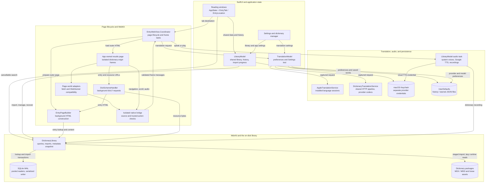
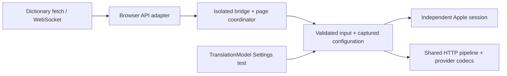

<p align="center">
  
</p>

<h1 align="center">Lexicon</h1>

A native macOS dictionary app that reads **MDX/MDD** dictionary files — the
format used by MDict, GoldenDict, Eudic and friends. Import your own
dictionaries (Oxford, Merriam-Webster, Collins, Longman, …) and search all of
them at once. Imported content works offline; HTTPS resources used by a
dictionary can optionally load under Settings → Content → Network access.

Lexicon ships no dictionary content. You supply `.mdx` files (with their
`.mdd` resource companions) that you have obtained yourself.

Looking for dictionaries? I've always been a big fan of the dictionary files
shared by [karx on the FreeMdict forum](https://forum.freemdict.com/u/karx/summary),
and the app has the best dictionary support for them right now. Of course, you
can also browse and download dictionaries you like on the forum. If you run
into any issues, please feel free to send feedback and I'll do my best to
support them.

<p align="center">
  
</p>

## Install

Lexicon follows the current macOS release and currently requires macOS 26 or later. Download the ZIP for your Mac from the
[GitHub Releases](https://github.com/yichenzhu1/lexicon/releases) page, unzip
it, and move `Lexicon.app` to `/Applications`.

The current build is for Apple Silicon (`arm64`). Release-specific details are
listed in the release notes rather than encoded in the filename.

## Features

- **One search box for every dictionary.** Unified, case- and
  diacritic-insensitive search across all enabled dictionaries, in tiers:
  exact and prefix matches first, then substring matches, then near misses
  when nothing matched literally.
- **Each dictionary keeps its own look.** Entries render with the
  dictionary's own CSS, images, and fonts served straight out of its `.mdd`,
  in one collapsible section per dictionary, with a jump bar when several
  dictionaries have the word.
- **A browser, not a form.** Windows and tabs with per-tab back/forward
  navigation, cross-reference links, look-up-on-double-click, and text zoom.
  Reading preferences and sidebar layout are remembered between launches.
- **Live translation.** Compatible OED/ODE/Longman dictionaries translate
  definitions and examples via Apple Translation (on-device), Google Cloud,
  DeepL, OpenAI, DeepSeek, Gemini, Claude, or Alibaba DashScope. See *Live
  translation* below.
- **Sentence text-to-speech.** System voices or Google Cloud Chirp 3 HD
  voices, plus pronunciation audio (`sound://`) played from `.mdd` resources.
  See *Text-to-speech* below.
- **Offline-first and private.** Imported dictionaries work fully offline;
  HTTPS content is optional, and API keys live in macOS Keychain, never
  exposed to dictionary content.
- **A real dictionary manager.** Import (with automatic `.mdd`/CSS/JS
  companions), enable/disable, drag to reorder, rename, and remove — plus
  lookup history and starred words in the sidebar.
- **Broad MDX support.** MDX v1/v2, zlib/LZO/uncompressed blocks, encrypted
  keyword indexes, UTF-8/UTF-16/GB18030/Big5, and multi-part MDDs.

The full list of changes in each version is in [`CHANGELOG.md`](CHANGELOG.md).

MDX v3 files (produced by MdxBuilder 4.x) are not supported; rebuild those
with MdxBuilder 3.x.

## Internal builds

Requires the current macOS SDK and a Swift compiler paired with that SDK.
Command Line Tools work when their compiler and SDK were installed together.

```sh
# Optimized internal build
scripts/make_app.sh
open build/Lexicon.app
```

Local builds are ad-hoc signed and are for development or trusted internal
testing only. Override the default version or build number when needed:

```sh
LEXICON_VERSION=0.3.0 LEXICON_BUILD_NUMBER=3 scripts/make_app.sh
```

The packaging script prefers the selected developer tools' macOS 26 SDK when
available, avoiding incomplete preview SDK installations. It prints the SDK
it uses. Set `SDKROOT` to an SDK name (such as `macosx26.5`) or an absolute SDK
path to choose explicitly; `DEVELOPER_DIR` selects the developer tools as usual.

## GitHub release

1. Update `CHANGELOG.md`, then run the complete release checks:

   ```sh
   swift build -Xswiftc -warnings-as-errors
   swift run -Xswiftc -warnings-as-errors MdxKitTester
   swift run -Xswiftc -warnings-as-errors Lexicon --tab-state-test
   swift run -Xswiftc -warnings-as-errors Lexicon --translation-test
   swift run -Xswiftc -warnings-as-errors Lexicon --tab-webview-test
   swift run MdxKitTester seed /tmp/lexicon-smoke
   LEXICON_ROOT=/tmp/lexicon-smoke swift run -c release Lexicon --smoke-test
   ```

2. Store notarization credentials once, then build a Developer ID-signed,
   hardened-runtime, notarized archive:

   ```sh
   xcrun notarytool store-credentials lexicon-notary \
     --apple-id "you@example.com" \
     --team-id "YOUR_TEAM_ID"

   LEXICON_VERSION=0.3.0 \
   LEXICON_BUILD_NUMBER=3 \
   LEXICON_SIGNING_IDENTITY="Developer ID Application: Your Name (TEAMID)" \
   LEXICON_NOTARY_PROFILE=lexicon-notary \
   scripts/release.sh
   ```

   `notarytool` prompts securely for the app-specific password instead of
   placing it in shell history.

   This writes `dist/Lexicon.zip` and `dist/Lexicon.zip.sha256`. The script
   verifies the signature, waits for Apple notarization, staples and validates
   the ticket, runs a Gatekeeper assessment, and creates the final archive.
   The version is embedded in the app's `Info.plist`, not in the filename.

   Verify a downloaded archive and checksum from the directory containing both:

   ```sh
   shasum -a 256 -c Lexicon.zip.sha256
   ```

   Running `scripts/release.sh` without both release credentials still creates
   an ad-hoc-signed archive for internal testing, but that artifact must not be
   published.

3. Commit all release changes.
4. Tag the exact commit, push, and publish the ZIP:

   ```sh
   git tag -a v0.3.0 -m "Lexicon 0.3.0"
   git push origin main
   git push origin v0.3.0
   gh auth login
   gh release create v0.3.0 \
     dist/Lexicon.zip \
     dist/Lexicon.zip.sha256 \
     --title "Lexicon 0.3.0" \
     --generate-notes
   ```

## Import dictionaries

Drag a `.mdx` onto the window, or click the books icon in the toolbar (or
⇧⌘I) and choose one. Any sibling files sharing its base name (`Dict.mdd`,
`Dict.1.mdd`, `Dict.png`, …) are copied along with it and indexed. Every `.css`
and `.js` file beside the MDX is also imported even when its name differs (for
example, `oald-fork.mdx` with `oald.css`, `oaldzh.css`, and `oald.js`). Lexicon
then discovers static local references in entry HTML and copied CSS and brings
along those dependent loose assets recursively. Everything lives in
`~/Library/Application Support/Lexicon/`.

If no MDD resources or loose companions are available, the import still
succeeds. Lexicon reports that condition and flags the dictionary in the
manager.

## Theming (custom.css)

Every entry page loads an optional `custom.css` from the dictionary's folder
in `~/Library/Application Support/Lexicon/Dictionaries/<id>/`, after the
dictionary's own stylesheets — drop a file there to restyle a dictionary.

## Text-to-speech

Lexicon can replace the online sentence TTS used by compatible ODE and OALD
repacks. Choose a provider in **Settings → Speech**:

- **System Voice** is the default. It uses English voices installed on the Mac,
  stays on-device, and works with dictionary network access disabled.
- **Google Cloud** uses Chirp 3 HD voices. Enable the Cloud Text-to-Speech API
  and billing in a Google Cloud project, create an API key restricted to that
  API, and paste it into Settings. The key is stored in macOS Keychain and is
  never exposed to dictionary JavaScript.

When a compatible dictionary requests sentence audio, Lexicon sends only the
requested English text and locale to the selected provider. Google Cloud usage
may incur charges.

## Live translation

Compatible OED, ODE, Longman 6, and similar repacks attach translation prompts
to definitions and example sentences. Lexicon intercepts both DashScope
`chat/completions` requests and Longman's signed iFlytek WebSocket before any
bundled credential or passage leaves the page. Choose a provider in
**Settings → Translation**:

- **Apple Translation** is the default. It uses the system Translation
  framework on-device with installed English and Simplified Chinese language
  packs. Settings shows language availability and download instructions inline.
  **Manage Translation Languages…** opens **System Settings → General →
  Language & Region → Translation Languages** directly. Download both languages
  there, then return to Lexicon and retry. Translation uses installed language
  packs without opening a download window or automatic setup alert. It needs
  no API key.
- **Translation APIs** contains Google Cloud Translation and DeepL. These
  dedicated services translate the extracted source passage. Google Cloud is
  predictable for modern examples; DeepL supports Free and Pro keys and
  preserves OED's supported markup.
- **AI Models** contains OpenAI (GPT), DeepSeek, Google Gemini, Anthropic
  Claude, and Alibaba DashScope. These receive the complete contextual prompt
  for definition-aware and markup-aware translations. Each provider has its
  own editable model name and Keychain credential.
- **Off** disables network and Apple live translation. Bundled bilingual
  content, including OALD's hidden Chinese examples, still works locally.

Every cloud provider has a separate credential stored in macOS Keychain; keys
are never exposed to dictionary JavaScript. General language models receive the
complete dictionary prompt so they can follow definition-aware and markup-aware
instructions. Google Cloud Translation receives the extracted source passage;
DeepL also receives the original dictionary prompt as translation context.
At most one translation request is accepted per real click,
passages are capped at 20 KB, and output is currently Simplified Chinese.
Provider calls are made by Lexicon itself, so live translation can remain under
the user's control even when dictionary-page network access is disabled.

## Tests

```sh
swift run MdxKitTester
swift run Lexicon --tab-state-test
swift run Lexicon --translation-test
swift run Lexicon --tab-webview-test
swift run Lexicon --search-focus-test
```

The search-focus test uses a disposable library and preferences, opens temporary
windows, and requires an active macOS desktop session. It checks initial focus,
window transitions, application hide/reactivation, selection, outside-click
dismissal, tab changes racing with dismissal, and marked-text
composition in the actual search field.

For repeatable parser, HTML, and resource-access performance measurements:

```sh
swift run -c release MdxKitTester benchmark
```

The benchmark uses temporary synthetic dictionaries and requires Python 3.

Tests use a small standalone runner compatible with Command Line Tools,
without requiring XCTest or swift-testing. Parser tests validate against fixture
dictionaries generated by the reference
[writemdict](https://github.com/zhansliu/writemdict) library
(`python3 tools/make_fixtures.py` regenerates them).

The suite also covers several things worth knowing about:

- **Damaged files.** Dictionary files are untrusted input, so every size and
  count in a header is validated. The corrupt-file tests feed the parser
  truncated, randomly damaged and deliberately oversized headers and require
  it to throw rather than trap. A regression shows up as the test executable
  crashing mid-run — that is the intended signal.
- **Concurrent access.** The library is read from the main thread and from the
  `dict://` handler's queue while imports run on their own queue, so the
  concurrency tests hammer it from many threads and check that reads stay
  available and correct during an import.
- **Rendering compatibility.** Page tests cover per-dictionary origins,
  structural-tag neutralization, URL/CSS normalization, lazy frames, anchors,
  network policy, and native-bridge isolation.
- **Translation.** Offline request/response tests cover every online provider,
  source extraction, HTTP failures, incomplete output, and cancellation. Apple
  tests cover installed/missing/unsupported languages without downloading packs.
  Settings tests cover saved preferences, credential errors, independent
  dictionary requests, and cancellation when provider configuration changes.
  WebKit checks exercise the dictionary adapters and request cleanup.
- **Tab isolation.** The app-state test checks the three-view MRU limit,
  eviction and closure, per-tab history, and delayed WebKit scroll messages.
- **Search focus.** The foreground-window test rejects delayed focus requests
  that steal focus after dismissal and checks that view updates preserve
  marked-text composition.
- **Recovery.** Imports use a staging directory and one index transaction;
  cancellation and startup-reconciliation tests require partial work to be
  removed or moved to the recoverable `Dictionaries/Recovery` directory.

There is also an end-to-end render check that drives a real offscreen
WKWebView, useful after touching the page builder or the scheme handler:

```sh
swift run MdxKitTester seed /tmp/lexicon-smoke
LEXICON_ROOT=/tmp/lexicon-smoke swift run -c release Lexicon --smoke-test
```

## Architecture

Lexicon separates shared dictionary data, window navigation, rendered pages,
and translation requests. Each component owns the state that changes with its
lifetime; the UI derives the selected word and scroll position from the tab's
location.

The overview below shows the main request paths. Results return to the window
or dictionary frame that initiated them; the ownership table follows the diagram.



The storage path includes validated `MdictFile` parsing and decompressed-block
caching. Runtime reads open MDX/MDD files on demand; imports parse their input
files and commit the index after the final dictionary folder is ready. Audio
playback stays under `LibraryModel`, with one cancellable task shared by
recordings and synthesized speech.

| Scope | Owner | State |
| --- | --- | --- |
| Application | [`LibraryModel`](Sources/Lexicon/LibraryModel.swift) | Shared library, dictionary list, history, starred words, general preferences, and speech playback |
| Window | [`AppState`](Sources/Lexicon/AppState.swift) | Search task and results, tabs, active tab, and resident WebKit views |
| Tab | `EntryTab` / `EntryLocation` | Word, anchor, preferred dictionary, scroll offset, and back/forward history |
| Rendered page | [`EntryWebView.Coordinator`](Sources/Lexicon/EntryWebView.swift) | Page loading, dictionary frames, and their translation tasks |
| Translation settings | [`TranslationModel`](Sources/Lexicon/TranslationModel.swift) | Provider/model preferences, native credential access, and the cancellable Settings test |

### Search and page lifecycle

Search runs outside `MainActor`, publishes prefix results before the broader
search, and checks cancellation before updating the UI. New queries keep the
previous results visible until current matches arrive, while immediately
rejecting clicks, arrow keys, and Return on the outdated snapshot. An empty
prefix phase keeps that snapshot until substring and fuzzy matching finish;
only a completed search with no matches clears it. Clearing the query resets
results immediately. Changes to the dictionary library trigger a fresh search.

Initial search focus uses a SwiftUI lifecycle task after the view is installed;
tab commands update focus directly. Native controls handle focus transfer,
including clicks into the reading page. The app neither clears focus through a
window-wide mouse monitor nor reassigns it on activation. Tab changes do not
enqueue delayed work that could override a later click or dismissal.

Page loading captures the destination and rendering preferences, constructs
HTML in a background task, then loads it into WebKit. The coordinator tracks
preparing, loading, and ready states. Replacing or dismantling a page cancels
its pending work; bridge messages are accepted only for the committed page
matching the tab's current destination. This prevents late scroll events or
translation requests from an old document changing the new page.

Each window keeps WebKit views for its three most recently used tabs. Tab
locations and navigation history survive view eviction, allowing less-used
tabs to release their WebKit resources and restore their reading position
when reopened.

The app owns the outer results page. Each dictionary renders in a separate
`dict://<uuid>` origin, with native permissions handled in an isolated WebKit
content world. [`EntryPageScripts`](Sources/Lexicon/EntryPageScripts.swift)
contains bridge and scroll behavior;
[`DictionaryServiceScript`](Sources/Lexicon/DictionaryServiceScript.swift)
adapts dictionary fetch/WebSocket APIs. Origin checks, trusted-click checks,
and native credential storage form the boundary between dictionary scripts
and system services.

### Storage and resource access

[`DictionaryLibrary`](Sources/MdxKit/DictionaryLibrary.swift) uses pooled
SQLite readers and a serialized writer in WAL mode. Readers can query the
committed index while an import builds its transaction. Import files are
prepared in staging and moved into their final folder before the index
transaction commits. Startup recovery handles interruptions between filesystem
changes and the database commit. Dictionary metadata is cached as one snapshot,
with loading, publication, and invalidation protected by the same lock.

After import, search uses the SQLite index. MDX/MDD handles open on demand:
reading an entry opens its MDX, and reading a resource opens the required MDD
volume. Extensionless resource lookups use indexed path ranges. Binary
resources use a small redirect probe before attempting text decoding, avoiding
conversion of entire binary payloads to strings just to detect a redirect.

The parser validates file layout before using record blocks and checks read
ranges before allocating buffers. Its read paths reuse decoded block data and
avoid temporary copies. HTML processing reuses compiled patterns and builds
replacement output in a forward pass. The [benchmark command](#tests) measures
these parser, HTML, and resource-access paths with synthetic dictionaries.

### Translation pipeline



Each translation captures its provider, model, region, and credential before
asynchronous work begins. A dictionary request returns its result or error to
the originating frame. The Settings test has its own task and status; changing
provider configuration cancels that test, while already-submitted dictionary
requests retain their captured configuration.
[`TranslationSettingsView`](Sources/Lexicon/TranslationSettingsView.swift)
observes `TranslationModel` directly, so test progress and model edits do not
broadcast changes through the shared library model.

[`Translation.swift`](Sources/Lexicon/Translation.swift) provides a validated
`TranslationInput`, an immutable `TranslationConfiguration`, and one cloud
execution path: build the provider request, perform HTTP, validate the response,
decode the provider format, and check for a complete, nonempty translation.
Provider-specific payloads preserve contextual prompts and supported markup.
[`AppleTranslationService`](Sources/Lexicon/AppleTranslationService.swift)
creates an independent installed-language session per request and handles
missing-language errors directly; availability queries serve the Settings UI.

The browser adapters share one pending-request registry. Completion, timeout,
abort, and page exit all remove the request and release its timer and abort
listener. Each socket holds its own request handle, and late responses are
ignored. Returned text is escaped before reaching dictionary HTML, preserving
only the supported OED `m`, `n`, and `o` tags where required.

## Project layout

- `Sources/MdxKit` — MDX/MDD parser, SQLite keyword index, dictionary library.
- `Sources/Lexicon` — SwiftUI app (search UI, WKWebView renderer, `dict://`
  scheme handler, translation, and speech services).
- `Sources/MdxKitTester` — standalone test runner
- `tools/` — fixture generator plus the vendored writemdict library

## Acknowledgements

- MDX format documentation: [writemdict fileformat.md](https://github.com/zhansliu/writemdict/blob/master/fileformat.md)
  and [mdict-analysis](https://bitbucket.org/xwang/mdict-analysis)
- LZO1X decompression provided by the MIT-licensed
  [lzokay](https://github.com/AxioDL/lzokay) implementation
- Test fixtures generated with [zhansliu/writemdict](https://github.com/zhansliu/writemdict)

## License

Lexicon is licensed under the
[Apache License 2.0](https://www.apache.org/licenses/LICENSE-2.0) — see
`LICENSE` for the full terms. Third-party dependencies and their licenses
are disclosed in [`THIRD_PARTY_NOTICES.md`](THIRD_PARTY_NOTICES.md).
